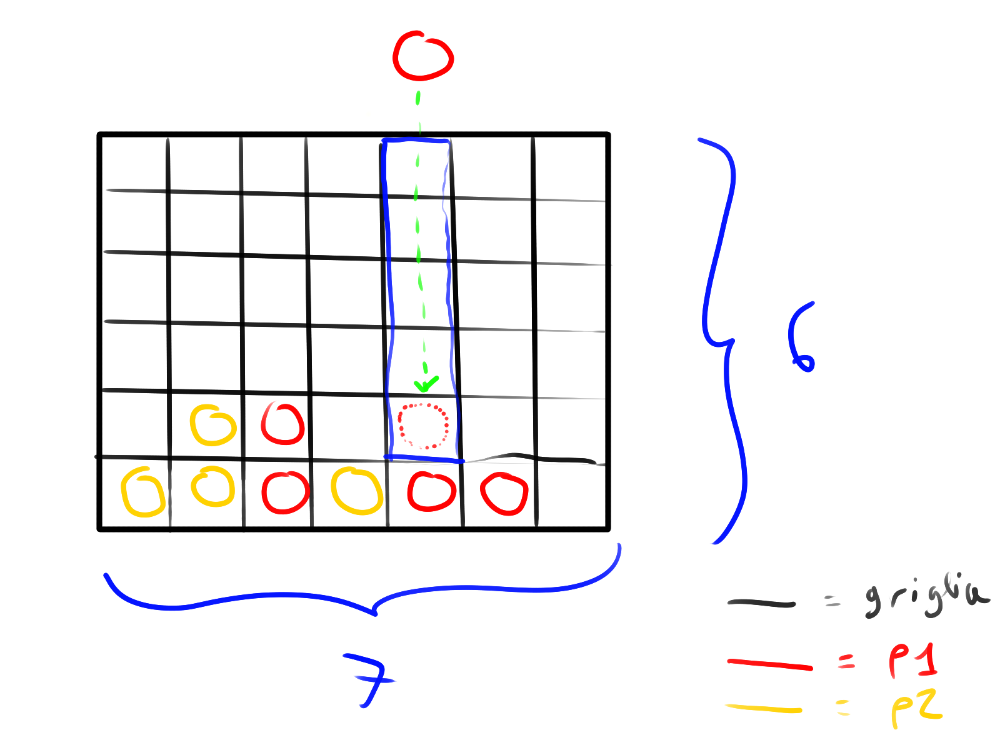

# Forza 4

Realizzare un'applicazione web che implementa il famoso gioco _Forza
4_.

Il gioco si sviluppa su una griglia 7x6. Lo scopo del gioco è
allineare un certo numero di pedine (quattro nel gioco di base) in
orizzontale, verticale o obliquo. La differenza di questo gioco a
giochi simili sta nella gravità: la scacchiera è posta in verticale
fra i giocatori, e le pedine vengono fatte cadere lungo una griglia
verticale, in modo tale che una pedina inserita in una certa colonna
va sempre a occupare la posizione libera situata più in basso nella
colonna stessa.
([Ulteriori informazioni](https://it.wikipedia.org/wiki/Forza_quattro),
fonte Wikipedia).

L'applicazione deve permettere a due giocatori _p1_ e _p2_ di giocare
sullo stesso computer in modo alternato. Inoltre, l'applicazione
consente di verificare quale dei giocatori ha vinto.
