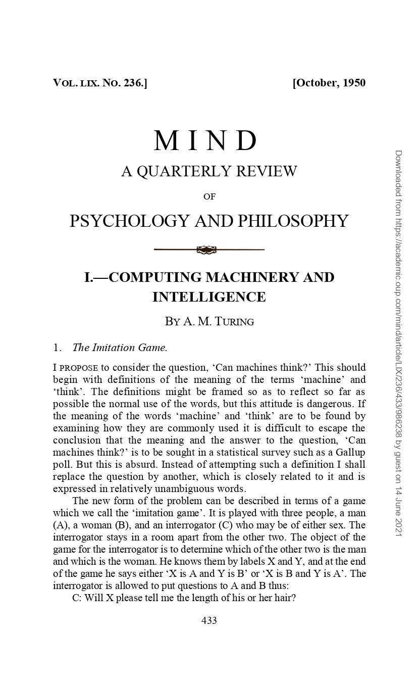

# Il test di Turing

{width=300}

Nel 1950 Alan Turing pubblica sulla rivista Mind, nella sezione
Psicologia e Filosofia, un articolo che inizia con la sezione "The
Imitation Game". La prima frase dell'articolo recita:

> I propose to consider the question, "Can machine think?"

Alan Turing cerca di introdurre un criterio per determinare se una
macchina sia in grado di esibire un comportamento intelligente
prendendo spunto dal gioco dell'imitazione (the imitation game).

Questo articolo è identificato da molti come l'inizio dell'era
dell'intelligenza artificiale e cambierà per sempre il modo di vedere
le macchine e i relativi programmi.

# Riferimenti

- [Wikipedia, _Il test di Turing_](https://it.wikipedia.org/wiki/Test_di_Turing)
- [Christos Papademetriou, _To what extent is the turing test still important?_](https://www.researchgate.net/publication/279023297_TO_WHAT_EXTEND_IS_THE_TURING_TEST_STILL_IMPORTANT)
