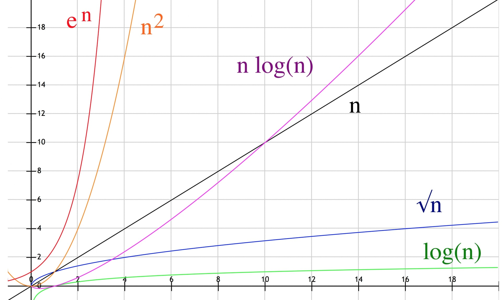

# Complessità Computazionale

Il costo di un algoritmo in termini di tempo di calcolo è spesso
funzione della dimensione dell'input. La figura riporta alcune delle
classi di complessità più diffuse per algoritmi tradizionali.

