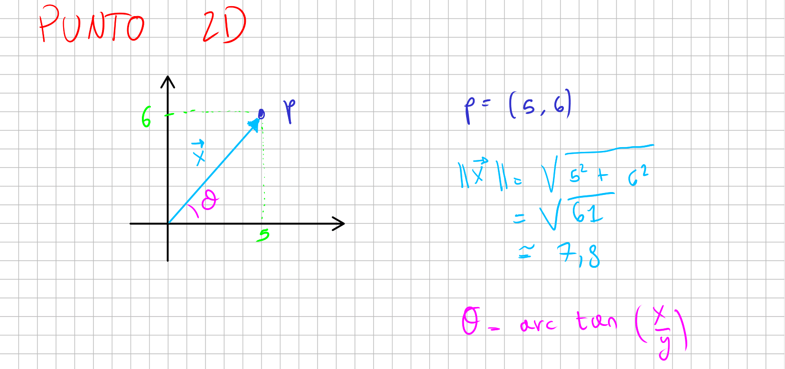
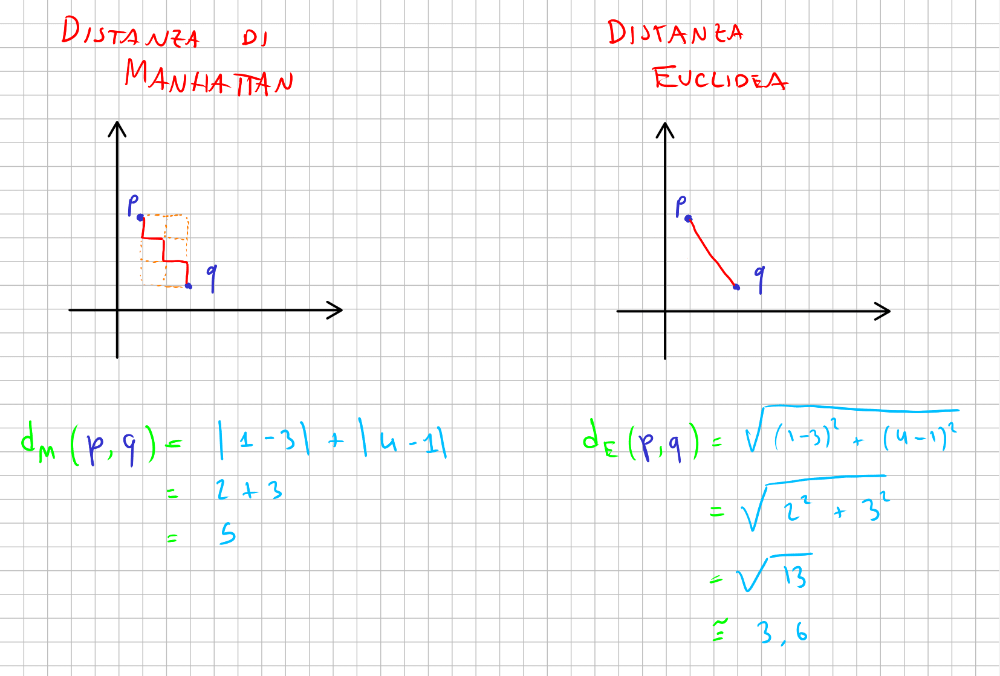

# Vettore

## Consegna

Si supponga di dover implementare un motore fisico per effettuare
simulazioni in generale. Vi viene richiesto di implementare il
supporto a vettori (o, analogamente, punti) $n$-dimensionali per
eseguire così simulazioni in spazi 2D, 3D ed anche multi-dimensionali.



Inoltre, vi viene richiesto di supportare diverse misure della
distanza tra due punti, in particolare la
[distanza euclidea](https://it.wikipedia.org/wiki/Distanza_euclidea) e
la
[distanza di Manhattan](https://it.wikipedia.org/wiki/Geometria_del_taxi).



Il progetto dovrà comporsi quindi di due classi: la classe `Vettore`
che implementa il concetto vero e prorpio di vettore (o punto) e la
classe `Vettori` (plurale!) che implementa operazioni di utilità su
vettori.

## Classe `Vettore`

La classe `Vettore` presenta le seguenti funzionalità:

- creazione del punto costutito da $n$ zeri;

- creazione di un punto 2D date $x$ e $y$;

- creazione di un punto 3D date $x$, $y$ e $z$;

- creazione di un punto $n$-dimensionale dato un vettore di
  componenti;

- accesso alle componenti tramite indice;

- calcolo dell'indice dell'elemento massimo del vettore;

- calcolo della $p$-esima norma del vettore. Di default, se non
  specificato, viene calcolata la norma 2 ($p = 2$). Dato un vettore
  $\boldsymbol{x}$, la sua norma $p$-esima $\|\boldsymbol{x}\|_p$ può
  essere calcolata come

  $$\|\boldsymbol{x}\|_p = \left( \sum_{i=1}^{n} |\boldsymbol{x}_i|^p \right)^{\frac{1}{p}};$$

- calcolo del prodotto scalare (anche detto _dot product_)
  $p \cdot q = \sum_{i=1}^{n} p_i q_i$;

- creazione di una copia (profonda) del vettore;

- accesso alla dimensione del vettore;

- calcolo del numero di elementi non-zero del vettore;

- (_estensione_) esegue una funzione data su ogni componente del
  vettore.

## Classe `Vettori`

La classe `Vettori` fornisce funzionalità generali su vettori. Il
calcolo delle operazioni su vettori dipende dalla funzione di misura
della distanza tra due vettori.

La funzione di misura della distanza tra due punti è definita come

$$d : \mathbb{N}^n \times \mathbb{N}^n \rightarrow \Re$$

ovvero una funzione che prende due vettori e restiuisce un numero
reale.

Le misure di distanza da supportare sono la distanza euclidea $d_e$ e
la distanza di Manhattan $d_M$. Dati $\boldsymbol{p}$ e
$\boldsymbol{q}$ due vettori, definiamo le due distanze
rispettivamente come

$$d_e(\boldsymbol{p}, \boldsymbol{q}) = \sqrt{ \sum_{i = 1}^{n} (\boldsymbol{p}_i - \boldsymbol{q}_i)^2}$$

e

$$d_M(\boldsymbol{p}, \boldsymbol{q}) = \sum_{i = 1}^{n} |\boldsymbol{p}_i - \boldsymbol{p}_i|.$$

La classe `Vettori` fornisce di conseguenza queste funzionalità:

- calcolo della distanza tra due vettori $d(p, q)$ che dipende dalla
  funzione $d$ utilizzata;

Attenzione: un'istanza della classe `Vettori` deve obbligatoriamente
prendere in input la funzione di misura della distanza utilizzata come
funzione high-order, ovvero passata come parametro.

## Esempio di utilizzo

Esempio di main per la classe `Vettore`.

```cpp
Vettore v0 = Vettore(4); // (0, 0, 0, 0)

v0.dimensione(); // 4
v0.numZero();    // 4

Vettore v1 = Vettore(1, 2); // (1, 2)

v1.accedi(0); // 1
v1[0];        // 1

v1.norma(1); // 3
v1.norma();  // ~ 2.23
v1.norma(2); // ~ 2.23

Vettore v2 = Vettore(1, 0, 1); // (1, 0, 1)
Vettore v3 = Vettore(2, 2, 3); // (2, 2, 3)

v2.dot(v3); // 5

Vettore v4 = Vettore({ 4, 0, 1, 3 }); // (4, 0, 1, 3)

v4.argmax(); // 0

Vettore v5(v4); // oppure... Vettore v5 = v4.copia();

v5.foreach([](int x) { std::cout << x << ", "; } )  // 4, 0, 1, 3,
```

Dall'esempio in figura 2. Vengono utilizzate entrambe le classi.

```cpp
// si assume che d_euclidea e d_manhattan siano
// due funzioni di misura della distanza tra due vettori
// già definite.

Vettore p = Vettore(1, 4); // (1, 4)
Vettore q = Vettore(3, 1); // (3, 1)

Vettori vettori;

vettori = Vettori(d_euclidea);
ve.distanza(p, q); // ~ 3.6

vettori = Vettori(d_manhattan);
ve.distanza(p, q); // 5
```
