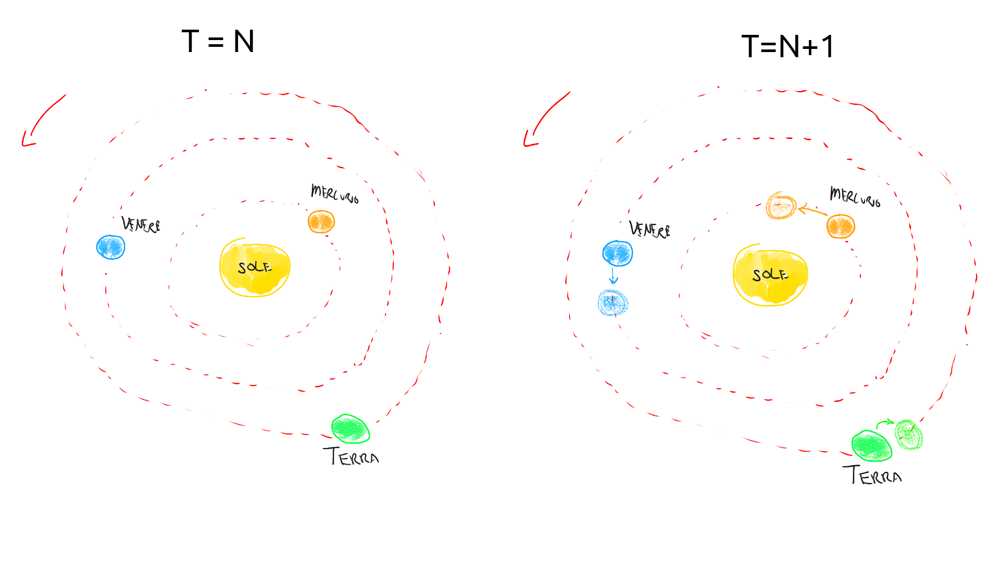
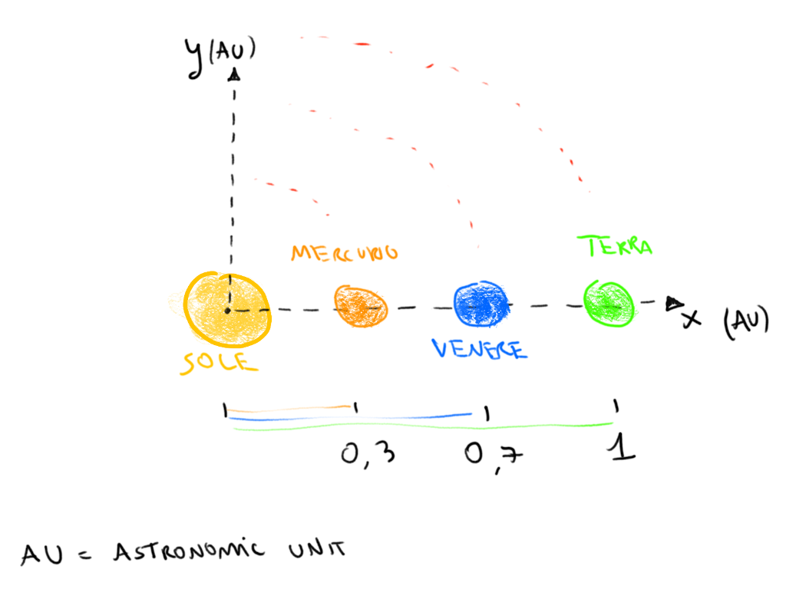
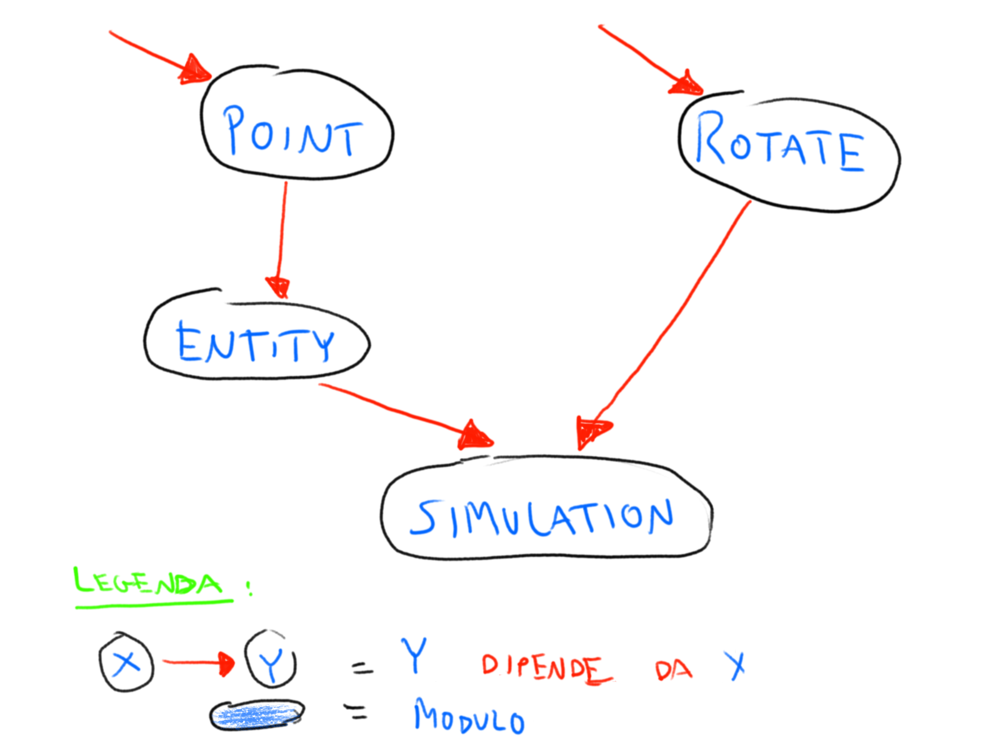

# Simulazione del sistema solare

## Consegna

Realizzare un'applicazione il cui scopo è quello di implementare una
simulazione (molto semplice e imprecisa) del sistema solare.

La simulazione è costituita dalle entità _sole_, _mercurio_, _venere_,
_terra_. Ogni entità è rappresentata dalla sua velocità di rotazione e
dalla posizione su un piano cartesiano dell'entità stessa. Lo scopo
della simulazione è ruotare queste entità attorno al sole e muoverle a
seconda della loro velocità di rotazione.

L'immagine seguente mostra un avanzamento del sistema solare dal tick
_N_ al tick _N+1_. (Figure _once_).



La simulazione riprodotta è molto semplice e le orbite dei pianeti
sono circonferenze perfette.

La simulazione nello stato iniziale vede tutti i pianeti allineati
sull'asse X (componente y della posizione = 0), pronti ad iniziare a
girare con velocità diverse e su orbite diverse. (Figura _fresh_)



### Implementazione

Il codice è suddiviso in moduli che implementano diverse funzionalità
della simulazione. Tutte le funzioni sono provviste di documentazione
non riportata qui. Si veda il codice per ulteriori dettagli.

#### `point`

Il modulo `point` implementa la funzionalità di "punto 2D" utile per
rappresentare entità (punti) su un piano cartesiano 2D.

Il tipo del punto è già definito.

Vanno implementate le funzioni

- `makePoint(x: Coord, y: Coord) : Point2D`
- `getX(p: Point2D): Coord`
- `getY(p: Point2D): Coord`

#### `rotate`

Il modulo `rotate` implementa la funzionalità di rotazione di un punto
2D. La rotazione può essere effettuata tramite la seguente:

Sia _p_ un punto 2D e siano _x_ e _y_ rispettivamente le componenti x
e y del punto _p_. \
Sia _theta_ un angolo in radianti e siano _s = sin(theta)_ e _c = cos(theta)_.\
Allora _xnew = x * c - y * s_ e _ynew = x * s + y * c_ sono le
coordinate x e y dopo la rotazione di _theta_ radianti del punto _p_.

Va implementata la funzione

- `rotate(angle: Radiant, point: Point2D): Point2D`

#### `entity`

Il modulo `entity` implementa il concetto di entità in un sistema
solare. Un'entità è un oggetto con due proprietà: posizione e velocità
di rotazione.

Vanno implementate le funzioni:

- `makeEntity(rotationSpeed: Speed, position: Point2D): Entity`
- `getPosition(entity: Entity): Point2D`
- `getRotationSpeed(entity: Entity): Speed`

#### `simulation`

Il modulo `simulation` implementa la simulazione vera e propria, dove
il sistema solare viene fatto progredire secondo le sue regole di
aggiornamento.

Vanno implementate le funzion

- `forwardEntity(entity: Entity): Entity`
- `forwardEntities(entities: Entity[]): Entity[]`
- `once(system: System): System`

## Estensioni

Realizzare le seguenti estensioni e cercare di testarle per quanto più
possibile.

### A. Dettagli sui pianet

Informazioni aggiuntive sulle entità trattate dalla simulazione
possono aiutare una futura GUI (Graphic User Interface) a visualizzare
la simulazione in modo più dettagliato, diversificando ad esempio la
dimensione dei pianeti.

Aggiungere un parametro che rappresenta la dimensione di un'entità
espresso con un'unità di misura adeguata all'obiettivo. Si richiede
anche di predisporre adeguate funzioni per l'accesso, modifica e
aggiunta di questa informazione.

### B. Modificare l'orbita

Tutti i corpi del sistema solare seguono un'orbita più o meno
ellittica.

Modificare le regole di aggiornamento del sistema solare per
supportare la rotazione di punti su orbite ellittiche. (Vedi
[ellissi](https://en.wikipedia.org/wiki/Ellipse) su Wikipedia).

> Attenzione: ogni entità segue un'orbita diversa da quella degli
> altri pianeti. La simulazione dovrebbe riuscire a supportare ordbite
> diverse per pianeti diversi.

_Suggerimento_. Un cerchio è un caso particolare dell'ellissi dove i
due fuochi _F1_ e _F2_ coincidono. Inizialmente, per semplificare lo
sviluppo, è quindi possibile utilizzare "ellissi circolari" e
riciclare i test su orbite circolari.

### C. Fascia di asteroidi

Il sistema solare per sua struttura, presenta una
[cintura di asteroidi](https://it.wikipedia.org/wiki/Sistema_solare#Fascia_degli_asteroidi)
tra le orbite di Marte e Giove, ovvero tra 2.3 e 3.3 UA dal Sole.

Aggiungere al sistema solare in modo automatizzato 10 mila asteroidi
generati in maniera randomica e distribuiti su tutta superificie della
fascia di asteroidi.

### D. Supporto 3D (opzionale)

Una simulazione più realistica, chiaramente, tiene conto anche della
componente Z dello spazio.

Modificare la simulazione di modo da aggiungere la terza componente e
rendere la simulazione tridimensionale.

> Attenzione: tutto il codice precedente e soprattutto i test devono
> essere ataddati.

## Istruzioni

### Pacchetto

Viene fornito uno zip con i sorgenti e relativi test dove sono state
parzialmente implementate alcune funzioni.

#### Dipendenze

Per iniziare lo sviluppo è prima necessario installare tutte le
dipendenze con

```bash
yarn
```

#### Test globali

Successivamente, con

```bash
yarn test
```

è possibile eseguire i test e verificare la correttezza
dell'implementazione.

#### Test singolo modulo

Molto utile per l'esercizio è anche il comando

```bash
yarn test path/to/modulo.test.ts
```

che permette di eseguire solo la suite di test per il modulo in
questione.

Ad esempio, il comando

```bash
yarn test src/__tests__/point.test.ts
```

esegue i test solamente per il modulo _point_.

### Codice

Il codice dei moduli da implementare risiedono nella cartella `src`.

In particolare, i file da modificare per svolgere l'esercizio sono

1. `src/point.ts`
2. `src/rotate.ts`
3. `src/system/entity.ts`
4. `src/simulation.ts`

Si consiglia inoltre di implementare le funzioni dei moduli
nell'ordine in cui sono stati elencati, ovvero partire dal modulo
_point_ e finire con il modulo _simulation_. Questo perché chiaramente
alcuni moduli necessitano delle funzionalità (più semplici) forniti
dagli altri moduli per funzionare. La Figura _dependency_ mostra quali
sono le dipendenze tra i moduli.



Ogni modulo ha a corredo una suite di test che vi permette di
verificare la correttezza di quanto implementato e capire quanto
l'esercizio è terminato.

Durante lo sviluppo consiglio quindi di focalizzarsi su un'unico
modulo per volta ed eseguire **solo** i test di quel modulo (vedere la
sezione [Test singolo modulo](#test-singolo-modulo)). Una volta
completato passare poi ad un altro modulo eseguendo solo i test di
quel modulo. Quanto ogni singolo modulo passa i suoi test, eseguire un
test generale con `yarn test` e verificare la correttezza dell'intero
sistema.

Nei moduli forniti sono presenti i prototipo delle funziona da
implementare con documentazione e suggerimenti. Inoltre, per ogni
funzione da implementare sarà presente un commento della forma

```typescript
// DA IMPLEMENTARE (~ XX righe di codice)
```

che fornisce anche un'indicazione sul numero di righe di codice che la
funzione richiede per essere implementata. Attenzione: l'indicazione è
approssimativa e non rappresenta in alcun modo un vincolo, ma sforare
di molto con le righe di codice rispetto a quanto indicato potrebbe
essere indicatore di un errore o di una logica errata.

### Quando consegnare

Lo sviluppo dell'esercizio termina quanto tutti i test passano.

**Nota**: per questo esercizio non è prevista l'interfaccia grafica
(che faremo in un secondo momento), ma solamente l'implementazione
delle funzioni per la simulaizone.

### Cosa consegnare

Utilizzare il comando

```bash
yarn pack
```

che produce un archivio compresso (di dimensioni molto ridotte) da
consegnare su teams. Attenzione: alcuni utenti Windows potrebbero non
riuscire ad aprire l'archivio generato in quanto non nativamente
supportato da Windows.
