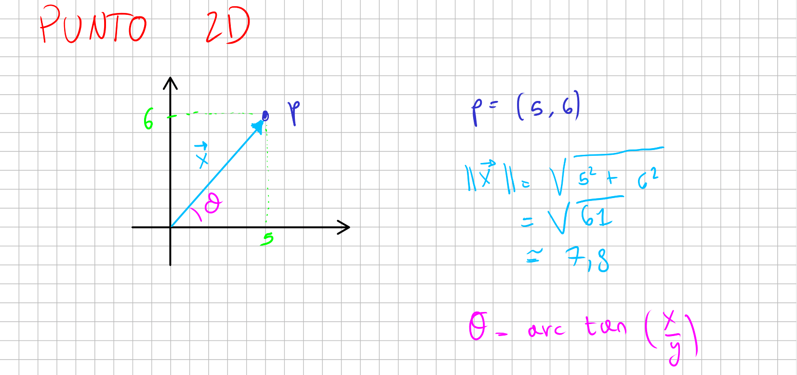

# Vettore

## Consegna

Si supponga di dover implementare un motore fisico per effettuare
simulazioni in generale. Vi viene richiesto di implementare il
supporto a vettori (o, analogamente, punti) $n$-dimensionali per
eseguire così simulazioni in spazi 2D, 3D ed anche multi-dimensionali.



Inoltre, vi viene richiesto di supportare diverse misure della
distanza tra due punti, in particolare la
[distanza euclidea](https://it.wikipedia.org/wiki/Distanza_euclidea) e
la
[distanza di Manhattan](https://it.wikipedia.org/wiki/Geometria_del_taxi).


Il progetto dovrà comporsi quindi di due classi: la classe `Vettore`
che implementa il concetto vero e prorpio di vettore (o punto) e la
classe `Vettori` (plurale!) che implementa operazioni di utilità su
vettori.

_Notazione_: $\boldsymbol{p}, \boldsymbol{q}$ sono due vettori in
$\mathbb{R}^n$. $\boldsymbol{p} = (p_1, p_2, \ldots, p_n)$ dove
$p_1, p_2, \ldots, p_n$ sono le componenti del vettore.
$\sum_{i=1}^{n}$ è l'operatore di somma per $i = 1$ fino ad $n$. $|x|$
è l'operatore di valore assoluto per un numero $x$.

## Classe `Vettore`

La classe `Vettore` presenta le seguenti funzionalità:

- creazione del punto costutito da $n$ componenti tutte con valore
  $x$. Se non specificato, $x = 0$;

- creazione di un punto 2D date le componenti $x$ e $y$;

- creazione di un punto 3D date le componenti $x$, $y$ e $z$;

- creazione di un punto $n$-dimensionale data una collezione di $n$
  componenti;

- creazione di una copia (profonda) del vettore;

- accesso alle componenti tramite indice;

- accesso alla dimensione del vettore;

- calcolo del numero di elementi non-zero del vettore;

- calcolo dell'indice dell'elemento massimo del vettore (arg max);

- esecuzione di una funzione data su ogni componente del vettore;

- opzionalmente, un modo per stampare il vettore a video;

- calcolo della somma (element-wise) tra vettori. Dati due vettori
  $\boldsymbol{p}$ e $\boldsymbol{q}$ in $\mathbb{R}^n$, la loro somma
  è un nuovo vettore definito come

  $$\boldsymbol{p} + \boldsymbol{q} = (p_1 + q_1, p_2 + q_2, \ldots, p_n + q_n);$$

- calcolo del prodotto (element-wise) tra vettori. Dati due vettori
  $\boldsymbol{p}$ e $\boldsymbol{q}$ in $\mathbb{R}^n$, il loro
  prodotto è un nuovo vettore definito come

  $$\boldsymbol{p} * \boldsymbol{q} = (p_1 * q_1, p_2 * q_2, \ldots, p_n * q_n);$$

- calcolo della $p$-esima norma del vettore. Di default, se non
  specificato, viene calcolata la norma 2 ($p = 2$). Dato un vettore
  $\boldsymbol{x} \in \mathbb{R}^n$, la sua norma $p$-esima
  $\|\boldsymbol{x}\|_p$ può essere calcolata come

  $$\|\boldsymbol{x}\|_p = \left( \sum_{i=1}^{n} |x_i|^p \right)^{\frac{1}{p}};$$

- calcolo del prodotto scalare (anche detto _dot product_). Dati due
  vettori $\boldsymbol{p}$ e $\boldsymbol{q}$ in $\mathbb{R}^n$ il
  loro prodotto scalare è definito come

  $$\boldsymbol{p} \cdot \boldsymbol{q} = \sum_{i=1}^{n} p_i q_i.$$

I dettagli non specificati sono lasciati all'implementazione. Notare
che il vettore è un tipo di dato astratto: dovranno essere
implementati gli operatori adeguati.

## Classe `Vettori`

La classe `Vettori` fornisce funzionalità generali su vettori. Il
calcolo delle operazioni su vettori dipende dalla funzione di misura
della distanza tra due vettori.

La funzione di misura della distanza tra due punti è definita come

$$d : \mathbb{R}^n \times \mathbb{R}^n \rightarrow \Re$$

ovvero una funzione che prende due vettori e restiuisce un numero
reale.

Le misure di distanza da supportare sono la distanza euclidea $d_e$ e
la distanza di Manhattan $d_M$. Dati $\boldsymbol{p}$ e
$\boldsymbol{q}$ due vettori in $\mathbb{R}^n$, definiamo le due
distanze rispettivamente come

$$d_e(\boldsymbol{p}, \boldsymbol{q}) = \sqrt{ \sum_{i = 1}^{n} (p_i - q_i)^2}$$

e

$$d_M(\boldsymbol{p}, \boldsymbol{q}) = \sum_{i = 1}^{n} |p_i - q_i|.$$

La classe `Vettori` fornisce di conseguenza queste funzionalità:

- calcolo della distanza tra due vettori
  $d(\boldsymbol{p}, \boldsymbol{q})$ che dipende dalla funzione $d$
  utilizzata;

Attenzione: un'istanza della classe `Vettori` deve obbligatoriamente
prendere in input la funzione di misura della distanza utilizzata come
funzione high-order, ovvero passata come parametro.

## Esempio di utilizzo

Esempio di main per la classe `Vettore`.

```cpp
Vettore v0 = Vettore(4); // (0, 0, 0, 0)
// Oppure... Vettore v0 = Vettore(4, 0);

v0.dimensione(); // 4
v0.nonZero();    // 0

Vettore v1 = Vettore({ 1, 2 }); // (1, 2)

v1.accedi(0); // 1
v1[0];        // 1

v1.norma(1); // 3
v1.norma();  // ~ 2.23
v1.norma(2); // ~ 2.23

Vettore v2 = Vettore({ 1, 0, 1 }); // (1, 0, 1)
Vettore v3 = Vettore({ 2, 2, 3 }); // (2, 2, 3)

v2.somma(v3); // (3, 2, 4)
v2 + v3;      // (3, 2, 4)

v2.dot(v3);   // 5

Vettore v4 = Vettore({ 4, 0, 1, 3, 2 }); // (4, 0, 1, 3, 2)

v4.argmax();  // 0

Vettore v5(v4); // oppure... Vettore v5 = v4.copia();

v5.foreach([](int x) { std::cout << x << ", "; } )  // 4, 0, 1, 3,
```

Dall'esempio in figura 2. Vengono utilizzate entrambe le classi.

```cpp
// si assume che d_euclidea e d_manhattan siano
// due funzioni di misura della distanza tra due vettori
// già definite.

Vettore p = Vettore(1, 4); // (1, 4)
Vettore q = Vettore(3, 1); // (3, 1)

Vettori vettori;

vettori = Vettori(d_euclidea);
ve.distanza(p, q); // ~ 3.6

vettori = Vettori(d_manhattan);
ve.distanza(p, q); // 5
```
